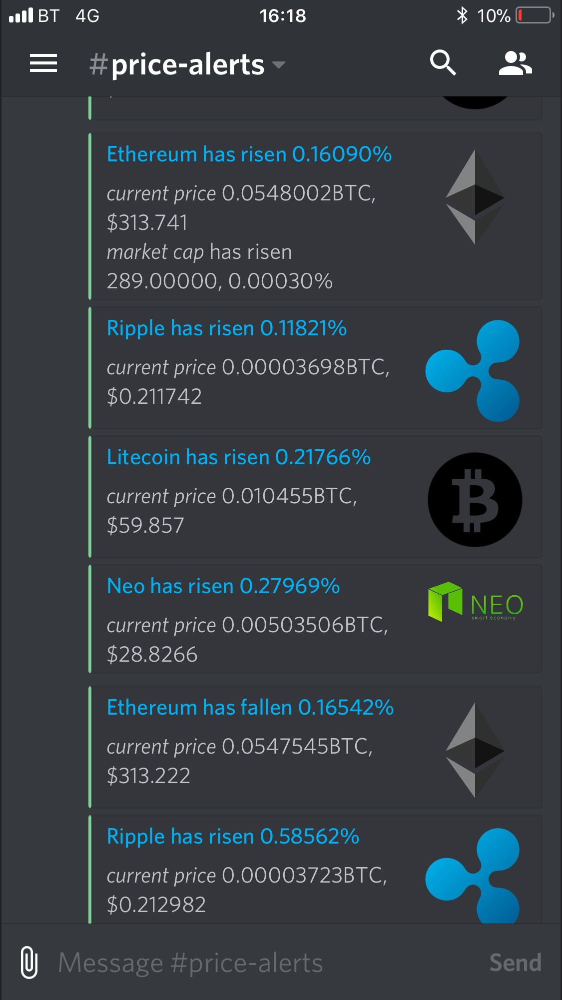
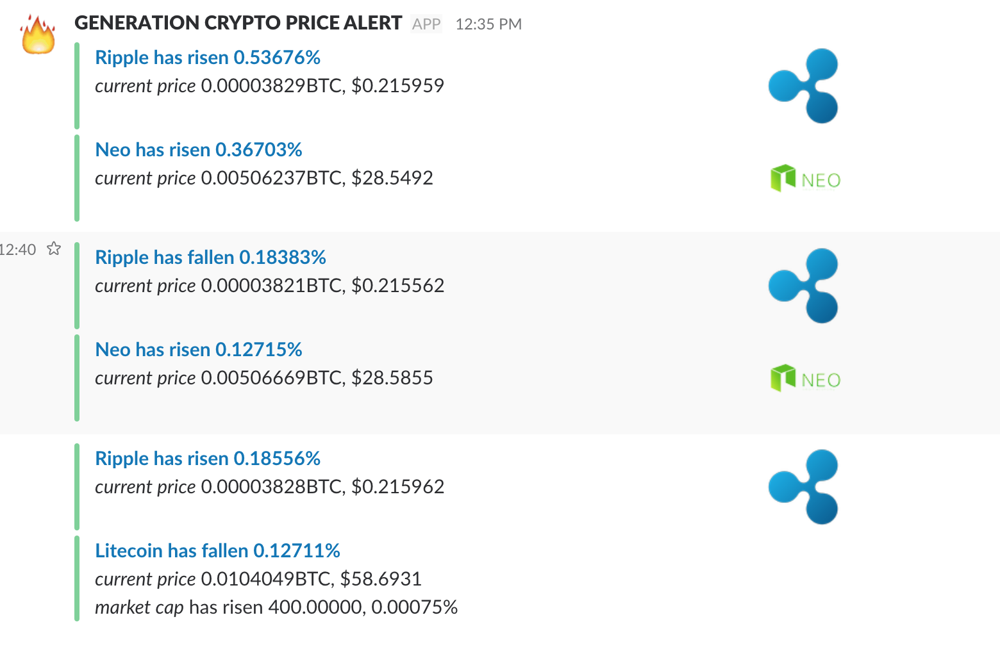

## coinmarketcap-slack-notifier

#### coinmarketcap-slack-notifier is an BSD licensed library written in Python providing an easy to use slack bot which sends notifications about changes on coinmarketcap to the `slack` channel(also, you can duplicate your messages to `discord` channel via webhook). This library has been tested with Python 2.7.x

### Installation

#### Clone repository and install dependencies
```bash
git clone https://github.com/Budulianin/coinmarketcap-slack-notifier.git
cd coinmarketcap-slack-notifier
virtualenv .venv
source .venv/bin/activate
pip install .
```

#### Set custom config
```bash
#default path:
/etc/notifier_settings.py
#you can set custom path:
export NOTIFIER_SETTINGS=/your_custom_path/notifier_settings.py
```
```bash
#notifier_settings.py
STORED_COINS_FILE_PATH = your_path_where_will_be_stored_json_file_with_coins
CHANNEL_NAME = name_of_your_slack_channel
SLACK_WEBHOOK_URL = your_slack_webhook_url
DISCORD_WEBHOOK_URL = your_discord_webhook_url


OBSERVABLE_COINS = [
    {'id': 'bitcoin', #you can choose which coins will be observable
     'icon_url': 'https://cdn3.iconfinder.com/data/icons/inficons-set-2/512/648849-star-ratings-512.png',
     'trigger_conditions': [{'percent_price_usd': 0.1, 'percent_total_supply': 0.1}, {'percent_price_usd': 0.1}]}, #and trigger conditions
    {'id': 'litecoin',
     'icon_url': 'https://pngimg.com/uploads/litecoin/litecoin.png',
     'trigger_conditions': [{'percent_price_usd': 5}],
     'slack_channel': 'general', #separate message about litecoin will be sent to this slack channel
     'discord_webhook_url': 'your_webhook_url'} #separate message about litecoin will be sent to this discord channel
]
```

#### Run application via cron
```bash
crontab -e

#schedule for cron
*/5 * * * * /your_path/coinmarketcap-slack-notifier/.venv/bin/python -m coinmarketcap_slack_notifier.cli run_notifier
```

## Examples of notifications

### Discord


### Slack

